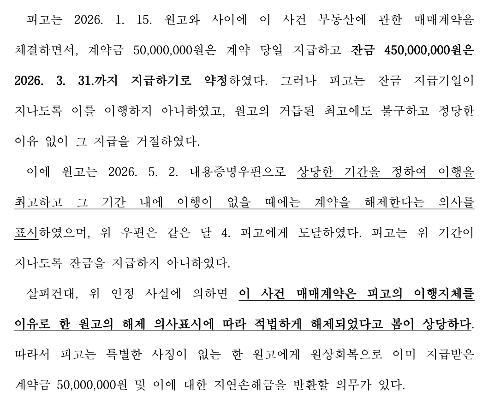
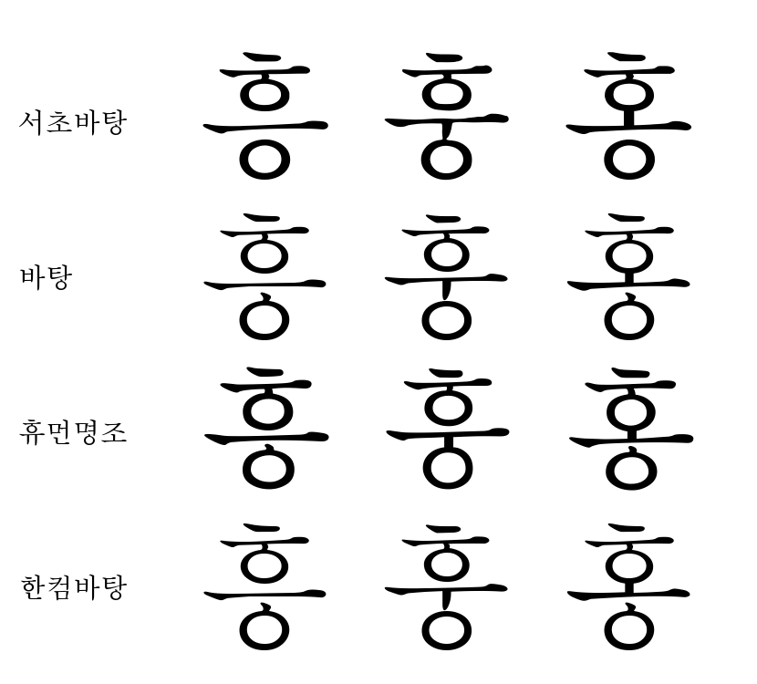

# 서초바탕 (Seocho Batang)

> **읽으시는 분께 익숙한 활자로 쓰는 서면.**

서초바탕은 법원 판결문 지면의 명조 자형을 오마주하여 독자적으로
제작한 **무료 한글 서체**입니다. 이름은 법률의 중심지 서초동에서
취했습니다. 한글 완성형 11,172자 전체와 판결문에 쓰이는 기호
(원문자 ①~㉟, 낫표 「」, 참고표 ※, 단위 ㎡ 등)를 수록했습니다.

**공식 배포 페이지**: [casedock.cloud/font](https://casedock.cloud/font) — 실시간 미리보기 · 원클릭 다운로드

## 왜 서초바탕인가

법률 서면을 작성하는 이들이 공통으로 겪는 어려움이 있습니다.
문서 환경을 옮기는 순간, 오래 쓰던 서체가 라이선스의 제약으로 함께
오지 못한다는 점입니다. 한편 판결문은 언제나 읽기에 좋았습니다.

서초바탕은 그 답을 서체로 만들었습니다.

- **서면의 마지막 독자는 재판부입니다.** 재판부에 가장 익숙한 활자의
  호흡을 그대로 담았습니다.
- **자음과 모음 사이의 여유.** 판결문 특유의 트인 속공간이 장문
  가독성을 만듭니다.
- **혼동하기 쉬운 글자일수록 또렷하게.** 흥·훙·홍이 한눈에 갈립니다.

- **숫자는 고정폭.** 날짜와 금액의 자리가 흐트러지지 않습니다.
- **법률 서면 표준 크기(11~13pt)의 인쇄 품질을 정량 관리합니다.**
  600dpi 기준 획 붙음 비율: 12pt 4.2%, 13pt 3.8%.

## 설치

[공식 배포 페이지](https://casedock.cloud/font) 또는 [Releases](../../releases)에서 최신 버전을 내려받으세요.

| OS | 방법 |
|---|---|
| Windows | `SeochoBatang-Regular.ttf` 우클릭 → **설치** |
| macOS | TTF 더블클릭 → **서체 설치** |
| Linux | `~/.local/share/fonts/`에 복사 후 `fc-cache -f` |

동봉된 `서면양식_서초바탕.docx`를 열면 권장 조판이 설정된 상태로
바로 서면 작성을 시작할 수 있습니다.

웹에서는 `fonts/SeochoBatang-Regular.woff2`를 사용하세요.

## 라이선스

**SIL Open Font License 1.1** — 개인·기업·관공서 어디서나 무료이며,
설치 수·사용 프로그램·문서 임베딩·재배포에 제한이 없습니다.
전문은 [OFL.txt](OFL.txt)를 보세요.

> 서초바탕은 법원의 공식 서체가 아닙니다. 공개된 판결문 지면의
> 자형을 참고하여 독자적으로 제작한 서체이며, 원본 폰트 파일의
> 데이터는 일절 사용하지 않았습니다.

## 제작기

이 서체가 만들어진 전 과정 — 파이프라인 소스코드, 학습 데이터와
가중치, 제작 노트 — 은 별도 저장소에 공개되어 있습니다:
**[SeochoBatang-Making](https://github.com/iwantanid/SeochoBatang-Making)**
